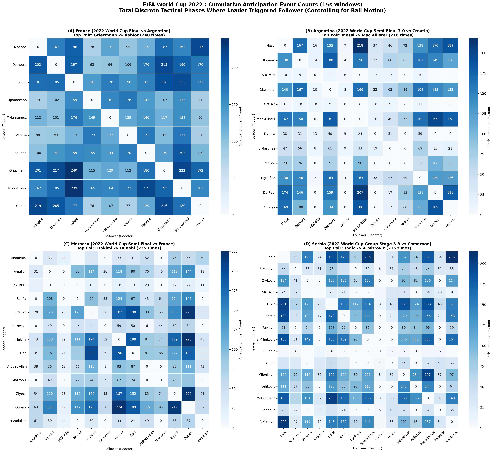
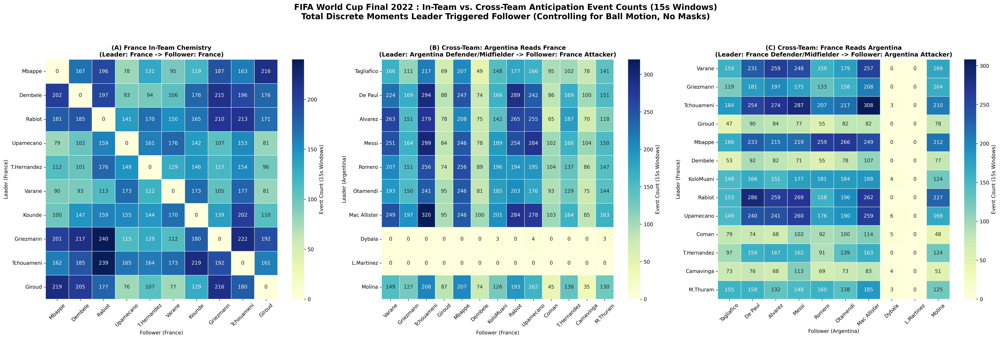

# Anticipation in Football

**From predicting opponents to understanding teammates.**

[](LICENSE)
[](docs/ABSTRACT.md)
[](pyproject.toml)

Anticipation is what enables elite football players to predict emerging tactical situations and respond before they unfold, whether by reading an opponent's cues or by understanding where a teammate is about to run. Historically, anticipation has been evaluated almost exclusively through isolated laboratory perceptual tests, offering limited insight into its continuous tactical expression during competitive match play.

**Anticipation maps** quantify this phenomenon directly from continuous optical player-tracking data. For every pair of players, they count the discrete match phases in which one player's preceding movement statistically *leads* another's, conditioning on continuous ball trajectory to ensure that co-orientation toward the ball is not mistaken for true interpersonal anticipation. Teammate-to-teammate and player-to-opponent anticipation are evaluated separately.

This repository accompanies the **MIT Sloan Sports Analytics Conference (SSAC 2027) research abstract submission** *"Anticipation in Football: From Predicting Opponents to Understanding Teammates"*. It provides all code, extracted velocity features, precomputed count matrices, and visualization tools required to reproduce the findings.

---

## How It Works

Built on the events and optical tracking data of the **PFF FC 2022 World Cup dataset** (sampled at 5 Hz):

1. **Movement Profiles:** For each rolling 15-second tactical window (with 50% step overlap), directional velocity components ($v_x, v_y$), speed, and ball-motion profiles are extracted.
2. **Granger Causality with Ball Conditioning:** Vector autoregression tests whether Player A's movement history significantly explains Player B's subsequent movement 1 to 2 seconds later ($F > 3.14$, $p < 0.05$), after controlling for Player B's own momentum and continuous ball dynamics ($b_x, b_y$).
3. **Discrete Recurrence Maps:** Significant predictive instances are accumulated across the match into integer count matrices, separately representing intra-team synchronization and cross-team defensive tracking.

---

## What the Evidence Shows

### Within-Team Anticipation Hierarchies

Anticipation maps reveal distinct tactical structures across teams with contrasting styles:

| Team (Match) | Strongest Anticipation Link(s) | Discrete Phases | Tactical Significance |
|---|---|---:|---|
| **France** (Final vs Argentina) | Tchouaméni ↔ Rabiot (reciprocal) | **293 / 275** | Central midfield double-pivot synchronization |
| **Argentina** (Semi-Final 3–0 vs Croatia) | Mac Allister ↔ Messi (reciprocal) | **218** | Primary playmaker hub |
| | Álvarez → Messi (attacking space) | **169** | Striker vacated runs opening pockets for #10 |
| **Morocco** (Semi-Final vs France) | Ziyech ↔ Hakimi (reciprocal) | **187 / 183** | Symmetrical flank overload synergy |
| **Serbia** (Group Stage 3–3 vs Cameroon) | Tadić → Mitrović (box runs) | **215 / 206** | Creator-to-target penalty box anticipation |



*Figure 1. Cumulative discrete anticipation event counts for France, Argentina, Morocco, and Serbia. Each cell displays the exact integer count of 15-second tactical phases where the Leader (Row) Granger-caused the Follower (Column) with p < 0.05 while conditioning on continuous ball trajectory. Outliers and inactive squad members are removed, with zeros explicitly displayed.*

---

### Intra-Team vs. Cross-Team Anticipation in the Final

In the **2022 FIFA World Cup Final (Argentina vs. France)**, separating intra-team chemistry from opponent tracking reveals:

* **France In-Team Chemistry:** Rabiot → Tchouaméni anchors France's internal rhythm (293 phases).
* **Argentina Reads France:** Argentine defenders aggressively anticipate French attacking runs, led by Mac Allister reading Tchouaméni (320 phases) and Romero tracking Kolo Muani (256 phases).
* **France Reads Argentina:** Tchouaméni anchors France's defensive screen, tracking Mac Allister (308 phases), Messi (287 phases), and Álvarez (274 phases).
* **Substitutions:** Players entering in extra time (Lautaro Martínez at 102' and Paulo Dybala at 120+1') exhibit near-zero values by construction, serving as empirical negative controls.



*Figure 2. Intra-team vs. cross-team anticipation networks in the 2022 World Cup Final. Each cell displays the raw count of 15-second tactical windows in which the Leader (row) Granger-caused the Follower (column), conditioning on ball motion; no masks are applied and zeros are explicitly displayed.*

---

## Reproduce the Results

To reproduce all figures and verify anticipation counts locally, clone the repository and run:

```bash
# 1. Clone repository
git clone https://github.com/fady-nasser/anticipation.git
cd anticipation

# 2. Install dependencies
pip install -r requirements.txt

# 3. Reproduce figures and verify results (< 15 seconds)
python reproduce.py
```

### Data Sharing & Reproducibility Notice
Raw optical player-tracking data contains proprietary coordinates that cannot be redistributed publicly. To ensure **100% mathematical reproducibility** without violating licensing agreements:
* All derived **5 Hz directional velocity profiles** ($v_x, v_y$) and ball trajectories for the four analyzed matches are included directly in [`data/extracted_features/`](data/extracted_features/).
* Anyone can re-run the Granger causality tests, recompute the count matrices, and regenerate the exact publication figures with zero external downloads or credentials.

---

## Code and Documentation

| Component | Path | Description |
|---|---|---|
| **Abstract** | [`docs/ABSTRACT.md`](docs/ABSTRACT.md) | Full submitted SSAC 2027 abstract text |
| **Captions** | [`docs/FIGURE_CAPTIONS.md`](docs/FIGURE_CAPTIONS.md) | Verbatim figure captions and tactical descriptions |
| **Reproduction** | [`reproduce.py`](reproduce.py) | Standalone 1-click reproduction script |
| **Granger Engine** | [`src/anticipation/granger.py`](src/anticipation/granger.py) | Vector autoregression and conditional F-test implementation |
| **Pipeline** | [`src/anticipation/pipeline.py`](src/anticipation/pipeline.py) | Rolling 15-second window event counting |
| **Visualization** | [`src/anticipation/visualize.py`](src/anticipation/visualize.py) | Heatmap rendering with explicit integer zero annotations |
| **Count Data** | [`data/count_matrices/`](data/count_matrices/) | Precomputed dyadic count matrices (CSV) |
| **Extracted Features** | [`data/extracted_features/`](data/extracted_features/) | Lightweight 5 Hz player velocity arrays (.npz) |

---

## Applications

* **Recruitment & Scouting:** Quantify whether an incoming transfer target exhibits natural movement compatibility with the current squad's core playmakers before signing.
* **Opponent Pre-Match Preparation:** Identify which opposing defenders consistently read your team's offensive triggers to design specific decoy runs and off-ball movement schemes.
* **Tactical Coordination:** Monitor squad synergy recovery and off-ball chemistry progression across competition phases.

---

## License

Code and derived data are released under the [MIT License](LICENSE).
